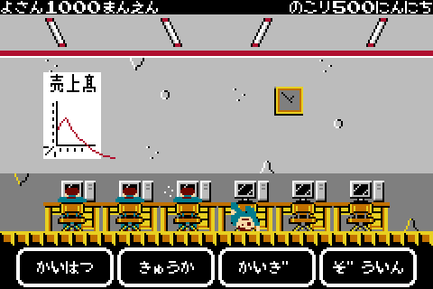

# シミュレーションゲーム

## 概要

ＳＥに指示を出し、低予算でプロジェクト完遂を目指すゲームです。

## 流れ

タイトル→ゲーム開始→プロジェクト完遂→ランキング登録

## 詳細

### 【よさん】

残り予算を示します。ゼロになるとゲームオーバーです。

### 【にんにち】

残り工数を示します。ゼロになるとゲームクリアです。

### 【よういん】

プロジェクトメンバーです。疲労度によって以下の状態に変化します。

#### 通常

元気な状態です。

#### 疲労

疲れている状態です。

#### 転倒

これ以上働くと辞めてしまいます。

#### 空席

誰もいません。増員しましょう。

### 【かいはつ】

開発を行うことで残り工数が減ります。ただし、人件費と疲労度が増加します。

### 【きゅうか】

プロジェクトメンバーの疲労度が回復します。もちろん有休なので予算は減ります。

### 【かいぎ】

会議で何かを決めます。何が決まるかは分かりません。

### 【ぞういん】

プロジェクトメンバーを増員します。当然、予算を使います。

## 注意点

- モバイル端末では画面を横向きでプレイしてください。
- Safariではツールバーを非表示にすることを推奨します。
- こんなげーむにまじにならないでください。

## 更新履歴

### 【2020/03/30】

- 公開。

## プレイ

[ここをクリックしてください。](https://m-owada.github.io/simulation-test/)

- 現在ランキング登録はできません。
